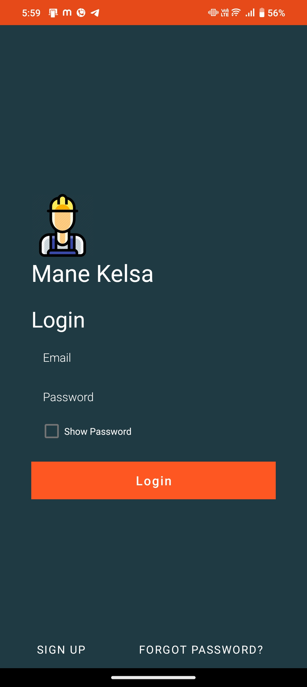
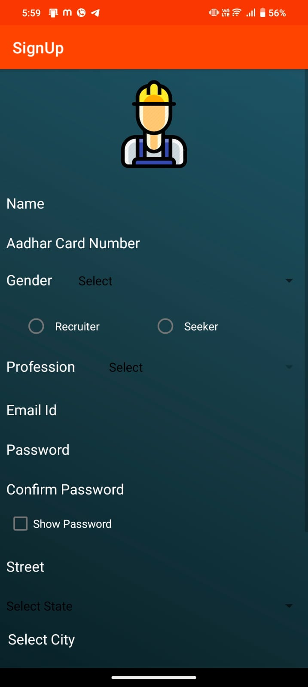
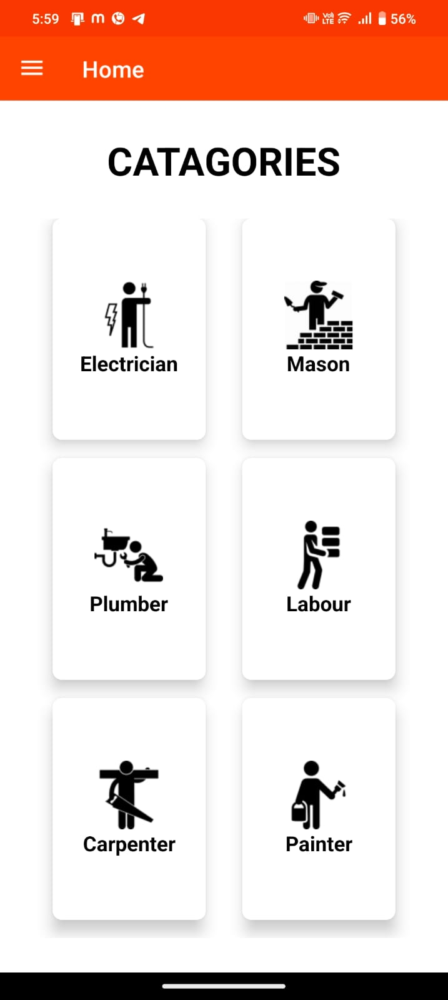
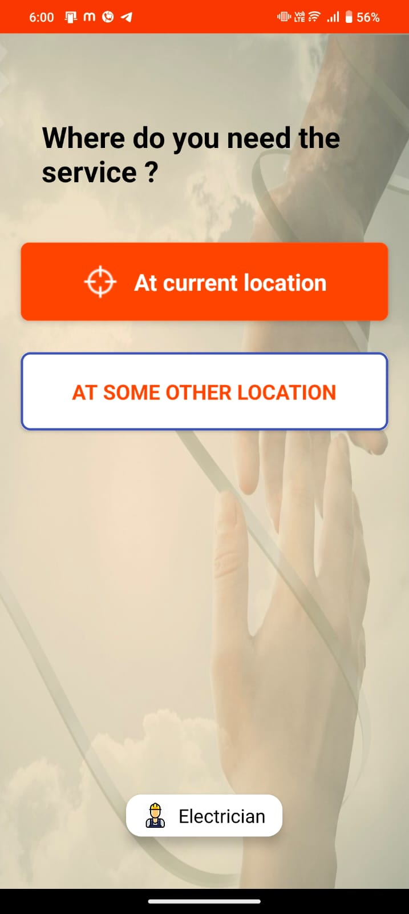
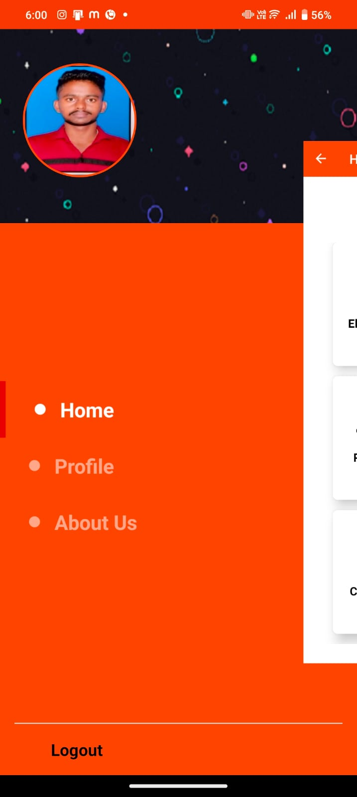

# 🛠️ Mane Kelsa (Shram) - Hyperlocal Worker Directory

**Mane Kelsa** (translated as "Home Work") is a premium Android application designed to bridge the gap between daily wage workers (Seekers) and individuals looking for skilled services (Recruiters). Built with a modern Material Design interface, the app provides a seamless platform for discovering, contacting, and reviewing local service providers.

## ✨ Premium Features
- 🚀 **Material 3 UI/UX**: A beautiful, vibrant teal-themed interface designed for simplicity and efficiency.
- 📍 **Hyperlocal Discovery**: Find workers in your specific city and neighborhood with integrated Google Maps.
- 📞 **One-Tap Contact**: Directly call or message workers through integrated APIs (including Fast2SMS support).
- 🔐 **Secure Authentication**: Robust Firebase Authentication for Seekers and Recruiters.
- 📸 **Portfolio System**: Seekers can upload profile pictures and work samples using Firebase Storage.
- ⭐ **Rating & Review System**: Build trust within the community through transparent worker feedback.
- ⚡ **Real-time Availability**: Seekers can toggle their "Available" status to manage work requests.

---

## 🛠️ Tech Stack
- **Language**: Java / Android SDK
- **Backend**: Firebase Realtime Database
- **Storage**: Firebase Storage (for profile and work images)
- **Maps**: Google Maps API & Play Services Location
- **Networking**: Volley (for Messaging API integration)
- **Image Handling**: Picasso & Android-Image-Cropper

## 🚀 Getting Started

### Prerequisites
- Android Studio Iguana or newer
- Java 8+
- Firebase Project (google-services.json)

### Setup
1. **Clone the repository**:
   ```bash
   git clone https://github.com/Bheemanna07/boss.git
   ```
2. **Add Firebase**: Place your `google-services.json` in the `app/` directory.
3. **Database Rules**: Ensure your Firebase Realtime Database rules allow authenticated access:
   ```json
   {
     "rules": {
       ".read": "auth != null",
       ".write": "auth != null"
     }
   }
   ```
4. **Build & Run**: Sync with Gradle and run on your preferred emulator or physical device.

---
# 🛠️ Mane Kelsa (Shram)

## App Screenshots

<p align="center">
  
  
  
</p>

<p align="center">
  
  
</p>
## 🤝 Contact & Support

**Maintenance**: [Bheemanna](https://github.com/Bheemanna07)
